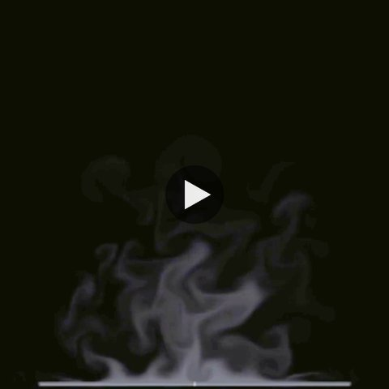
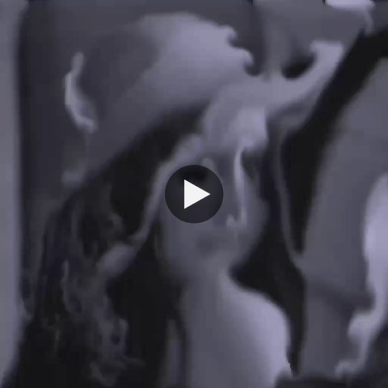
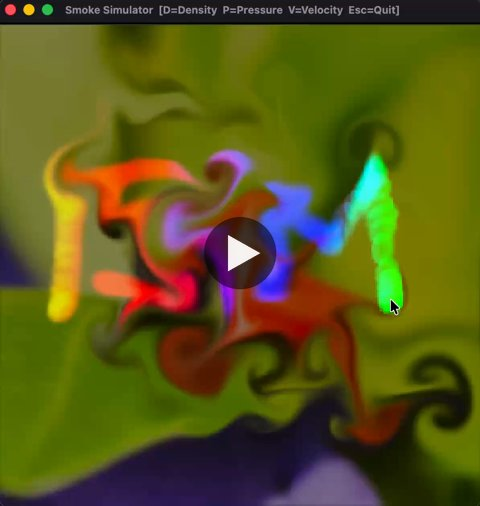
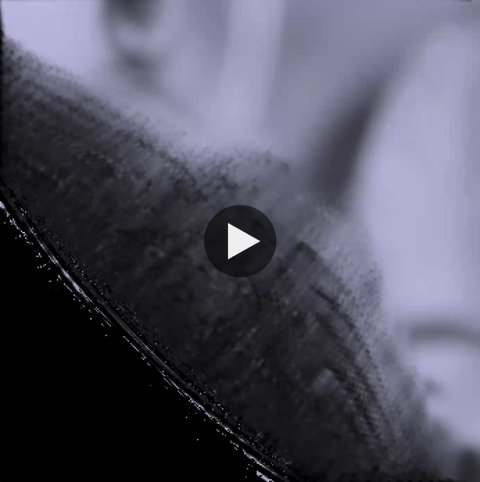

# smoke-simulator
ISIM Project, image synthesis of a smoke

Authors : Evrard & Elie

## Results

### Coffee smoke
Smoke rising from a source at the bottom of the grid, then integrated into a coffee cup scene that we modeled in Blender.

<table>
  <tr>
    <td><a href="https://github.com/user-attachments/assets/0bad6403-8b0b-4753-a237-674c86413737"></a></td>
    <td><a href="https://github.com/user-attachments/assets/52ef8b64-e837-4f79-8e3f-7d2fc344d627"></a></td>
  </tr>
  <tr>
    <td align="center">Simulation</td>
    <td align="center">Integration in the Blender scene</td>
  </tr>
</table>

### Buoyancy
A grayscale image is loaded as the initial smoke density. The buoyancy force pushes the densest (brightest) areas upward and the image dissolves into smoke.

[](https://github.com/user-attachments/assets/06d5cc1b-698b-41c6-a3a4-6861f9e963a2)

### Live demo
Real-time interactive session: a color image turned into smoke, pushed with the left click, with colored smoke added with the right click.

[](https://github.com/user-attachments/assets/ca6c458f-e4a4-45dc-894b-a1b982232b93)

## Requirements
- CMake (>= 3.10) and a C++20 compiler
- SFML 3 (`brew install sfml` on macOS)
- ffmpeg (optional, to turn the frames into a video)

## Build
```sh
cmake -S . -B build
cmake --build build -j
```

## 2D simulation (real time)
```sh
# grayscale smoke (draw with the mouse)
./build/2D/smoke-simulator-2D
# a color image turned into smoke (default: assets/ladybug.png)
./build/2D/smoke-simulator-2D --image
./build/2D/smoke-simulator-2D --image my.png
```
Controls: left click + drag = push the smoke, right click = add smoke, D / P / V = density / pressure / velocity view, Esc = quit.

## 3D simulation (offline ray marching)
```sh
./build/3D/smoke-simulator-3D --frames 100

# gather images into video
ffmpeg -framerate 24 -i outputs/3D/frame_%04d.ppm -c:v libx264 -crf 18 -pix_fmt yuv420p outputs/3D/smoke3D.mp4
```
Each frame is saved to `outputs/3D/` as soon as it is rendered, so the result can be watched while the render goes on. The other test scenes render a single image: `basic`, `style`.

## Artistic fail
Not every run went as planned. This unexpected result came up during development, and we liked it enough to keep it.

[](https://github.com/user-attachments/assets/1c8085ce-befd-431d-8edf-32941234cdd4)
